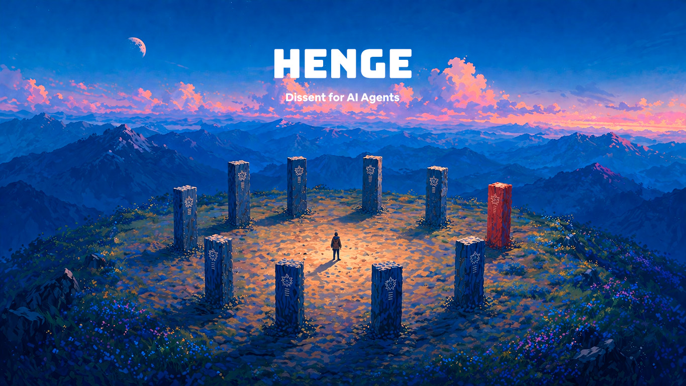
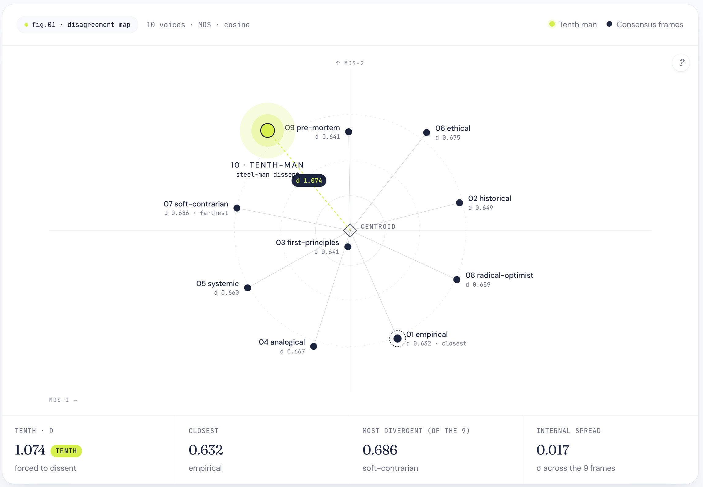
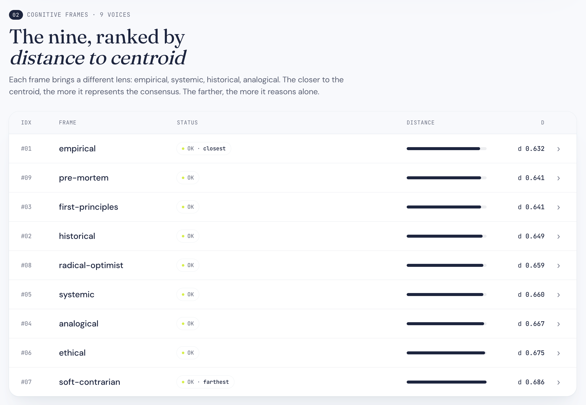

# Henge · 9 advisors. 1 mandatory dissenter.



Ten pillars.
Nine align.
One must disagree.

Henge is an MCP server that measures AI consensus and uses a structured dissent role — the **Tenth Man** — implemented through **steel-manning** to challenge the consensus before you act. Built for humans making serious decisions with AI in the loop — also drivable by autonomous agents.

**[→ See a live demo report](https://chrispiz.github.io/Henge/demo.html)**

---

## Quickstart · Claude Code (30s)

Paste this prompt into Claude Code and it self-installs by running a deterministic shell script — no LLM step-following, no drift:

````
Install Henge from https://github.com/ChrisPiz/Henge. Idempotent flow:

1. Clone shallow (or pull if already there):
   git clone --single-branch --depth 1 https://github.com/ChrisPiz/Henge.git ~/Henge \
     || (cd ~/Henge && git pull --ff-only)

2. cd ~/Henge && cp -n .env.example .env

3. Ask me for ANTHROPIC_API_KEY and OPENAI_API_KEY one at a time. When I paste each one, update the matching line in ~/Henge/.env in-place. Confirm only the LENGTH back to me ("got it, 108 chars") — never echo the value to the chat or any other tool.

4. Run the setup script — it handles Python ≥3.11 (with a 15-minute pyenv install fallback if missing), the venv, the editable install, the cross-cwd sanity check, key validation, MCP registration for every host installed (Claude Code, Claude Desktop, Cursor), and the /decide slash command:
   cd ~/Henge && ./setup

5. When the script prints "✓ Henge installed.", tell me to fully quit Claude Code (close ALL terminals running `claude`) and reopen, then try `/decide should I take the new job?`.
````

Restart Claude Code fully when it's done, then try:

```
/decide should I take the new job?
```

> **Note:** the `/decide` slash command is **Claude Code only**. In Claude Desktop and Cursor, MCP tools don't appear as slash commands — you invoke Henge by writing your question normally ("Should I quit my job to start a company?") and Claude picks up the `decide` tool from its description, or you can mention it explicitly ("use the decide tool to analyze ...").

For Claude Desktop, Cursor or any other MCP host, see [Manual install](#manual-install) at the bottom.

---

## The problem

AI systems don't fail because they lack intelligence.

They fail because:
- they converge too fast
- they reinforce assumptions
- they mistake agreement for truth

Consensus is cheap. Correct decisions are not.

---

## What Henge does



Henge runs your question through ten cognitive perspectives and:

1. Asks 4–7 scoping questions before reasoning, so the advisors apply to facts instead of speculation
2. Runs nine cognitive frames in parallel — each with its own lens
3. Embeds the answers, projects them with classical MDS, and measures cosine distance to the centroid of the nine
4. Assigns a **Tenth Man** (mandatory dissent role) and runs **steel-manning** to build the strongest possible case against whatever consensus emerged
5. Persists a full HTML report + JSON record on disk and opens it in your browser

---

## Why this is different

| Approach              | Problem                       | Henge                              |
| --------------------- | ----------------------------- | ---------------------------------- |
| Single LLM            | Overconfident answers         | Multi-frame reasoning              |
| Multi-agent debate    | Noisy, redundant              | Measures structure, doesn't echo   |
| Devil's advocate      | Weakly argues against         | Tenth Man steel-mans the strongest opposing case |
| Fixed "tenth man" rule| Hard-coded contrarian         | Tenth Man triggers + measurable distance         |

---

## How dissent works

Henge separates **role** from **method**.

- **Tenth Man** is the *role* — a structural, mandatory dissenter, assigned regardless of how much the 9 agree. The role exists to test the consensus, not to disagree with it for the sake of disagreement.
- **Steel-manning** is the *method* — the dissenter does not argue weakly or randomly. It builds the strongest possible version of the opposing case, grounded in the best precedents and cleanest reasoning available.

```
Role:    Tenth Man
Method:  Steel-man
Purpose: Challenge the consensus by constructing the strongest opposing case
```

The dissenter runs four steps, in order:

1. Assume the consensus may be wrong
2. Identify the strongest alternative perspective
3. Steel-man that alternative — make it as strong as possible
4. Show under what conditions it defeats the consensus

### Not a devil's advocate

This is not a devil's advocate.

A devil's advocate weakly argues against something — often for sport, often without conviction.

Henge's Tenth Man builds the **strongest** version of the opposing view. If you walk away from the report disagreeing with the dissent, it should be because you genuinely defeated the strongest case against you — not because the case was easy to dismiss.

---

## Core principle


Forcing disagreement without consensus is noise.

Henge does not simulate debate. It analyzes the structure of thought, then quantifies the distance between voices so the dissent has somewhere to land.

---

## Before you install

Quick checklist so the install doesn't surprise you:

- **Python ≥3.11.** macOS still ships Python 3.9. The Claude Code paste prompt detects this and installs Python 3.11.9 via pyenv automatically (no admin/sudo, but the build takes ~10 min the first time).
- **Two API keys.** `ANTHROPIC_API_KEY` (mandatory — runs the 10 advisors) and `OPENAI_API_KEY` (embedding provider).
- **Restart Claude Code fully after install.** Close ALL terminals running `claude`, then reopen. The MCP catalog is loaded once at startup; a running session will never pick up a freshly-registered server.

---

## How it works

```
question
   ↓
┌─ phase 1 ─────────────────────┐
│ scoping (Haiku 4.5)           │
│ → 4–7 clarifying questions    │
└───────────────────────────────┘
   ↓ user answers
┌─ phase 2 ─────────────────────┐
│ 9 frames in parallel (Sonnet) │
│ ↓                             │
│ embeddings (OpenAI)           │
│ ↓                             │
│ classical MDS + cosine        │
│ ↓                             │
│ consensus synthesis (Haiku)   │
│ ↓                             │
│ Tenth Man via steel-man (Opus)│
│ ↓                             │
│ disagreement map + report     │
└───────────────────────────────┘
```

The verdict is one of three states:

- **aligned-stable** — the nine cluster tightly and the tenth's dissent is moderate
- **aligned-fragile** — the nine are tight but the tenth pushes far enough to break it coherently
- **divided** — the nine themselves are spread; there was no real consensus to attack

---

## Cognitive frames

Nine consensus frames + one mandatory dissenter:

| # | Frame              | Lens                                                      |
|---|--------------------|-----------------------------------------------------------|
| 1 | empirical          | quantification, base rates, [assumption] markers          |
| 2 | historical         | precedents — what happened the last 3–5 times             |
| 3 | first-principles   | reduce to physical / economic / logical atoms             |
| 4 | analogical         | cross-domain mappings (biology, military, finance)        |
| 5 | systemic           | feedback loops, second- and third-order effects           |
| 6 | ethical            | deontological + consequentialist tension                  |
| 7 | soft-contrarian    | surgical reframe of the loaded silent assumption          |
| 8 | radical-optimist   | what unlocks if it goes 10× better                        |
| 9 | pre-mortem         | assume it failed in 12 months — describe how              |
| 10| **Tenth Man**      | mandatory dissent role · method: steel-man, after the nine align |

All frames respond in the **same language as the question** (Spanish question → Spanish answer; English → English). The report chrome (headings, labels, reading guide) follows the same rule by auto-detecting the question's language; force a single locale with `HENGE_LOCALE=en` or `HENGE_LOCALE=es` in your `.env`.




---

## Models & costs

| Stage              | Model                | Why                                |
| ------------------ | -------------------- | ---------------------------------- |
| Scoping            | Claude Haiku 4.5     | fast, cheap, ~3–5 s per call       |
| 9 cognitive frames | Claude Sonnet 4.6    | quality reasoning, parallel        |
| Consensus synthesis| Claude Haiku 4.5     | summarization, structured output   |
| Tenth-man dissent  | Claude Opus 4.7      | hardest reasoning, fully sequential|
| Embeddings         | OpenAI               | `text-embedding-3-small` by default|

Typical cost per full run: **~USD 0.65** (range USD 0.50–0.80 depending on token spread).

---

## Use cases

- founder & operator decisions
- hiring / scaling / firing
- product strategy and prioritization
- risk analysis & pre-mortems
- counterfactual reasoning
- AI agent orchestration where you need a structured second opinion

---

## What this is NOT

- not a chatbot
- not a debate simulator
- not a multi-agent chat
- not a vibe-checker

It is a **decision-quality** tool. The output is a measurable structure of agreement and disagreement, not a longer answer.

---

## Roadmap

- numeric consensus-strength scoring
- dissent-impact scoring
- adaptive frame selection (only run the lenses that matter)
- PDF / shareable web report
- streaming results
- multi-model support (Gemini, GPT, local)
- local embeddings (sentence-transformers, no API key required)
- **dissent methods** — alternative implementations of the Tenth Man role:
  - steel-man (current default)
  - risk analysis (planned)
  - data-driven contradiction (planned)

---

## Design philosophy

- don't generate more answers → generate better structure
- don't simulate intelligence → measure it
- don't force dissent → earn it

---

## Mental model

Henge is not trying to be right.

It is trying to make your thinking harder to break.

---

## Developer reference

For Tool API, output structure, manual installs (Claude Desktop / Cursor), embeddings provider config, architecture, and troubleshooting, see **[DEVELOPER.md](DEVELOPER.md)**.

---

## License

MIT
